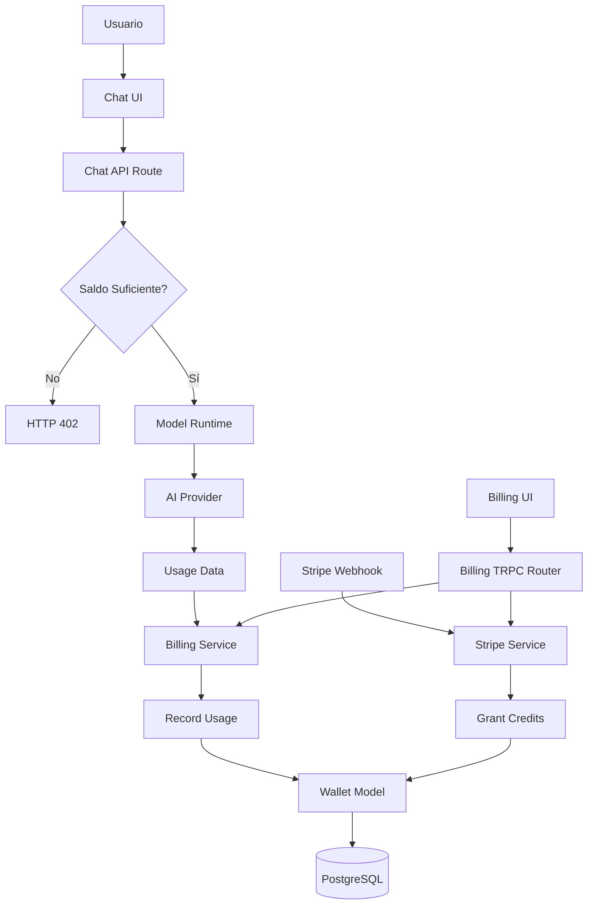
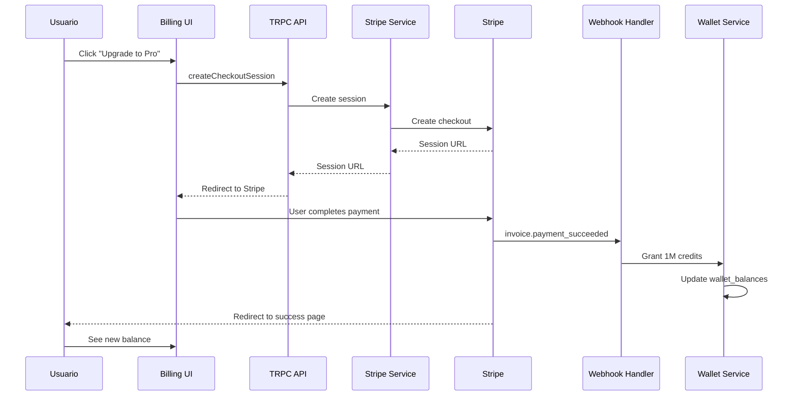

# Plan Integral de Implementación del Sistema de Pagos para LobeChat

## 📋 Resumen Ejecutivo

Este documento constituye el **plan maestro** para implementar un sistema completo de pagos, gestión de créditos y suscripciones en LobeChat. El análisis revela que **la infraestructura base ya existe**: tablas de base de datos, cálculo de costos y medición de tokens están implementados, pero **falta la capa de lógica de negocio y la integración con proveedores de pago**.

---

## 🔍 Análisis del Estado Actual

### 1. Infraestructura de Base de Datos Existente

#### Tablas Implementadas (Migración 0003_naive_echo)

```sql
-- Tabla de presupuestos por usuario
CREATE TABLE "user_budgets" (
  "id" text PRIMARY KEY NOT NULL,
  "free_budget_id" text,
  "free_budget_key" text,
  "subscription_budget_id" text,
  "subscription_budget_key" text,
  "package_budget_id" text,
  "package_budget_key" text,
  "created_at" timestamp with time zone DEFAULT now() NOT NULL,
  "updated_at" timestamp with time zone DEFAULT now() NOT NULL,
  FOREIGN KEY ("id") REFERENCES "users"("id") ON DELETE cascade
);

-- Tabla de suscripciones
CREATE TABLE "user_subscriptions" (
  "id" text PRIMARY KEY NOT NULL,
  "user_id" text NOT NULL,
  "stripe_id" text,                    -- ID de suscripción en Stripe
  "currency" text,
  "pricing" integer,
  "billing_paid_at" integer,
  "billing_cycle_start" integer,
  "billing_cycle_end" integer,
  "cancel_at_period_end" boolean,
  "cancel_at" integer,
  "next_billing" jsonb,
  "plan" text,
  "recurring" text,
  "storage_limit" integer,
  "status" integer,
  "created_at" timestamp with time zone DEFAULT now() NOT NULL,
  "updated_at" timestamp with time zone DEFAULT now() NOT NULL,
  FOREIGN KEY ("user_id") REFERENCES "users"("id") ON DELETE cascade
);
```

**✅ Estado:** Migradas y listas, pero **NO tienen esquemas de Drizzle** ni modelos de acceso implementados.

### 2. Sistema de Medición de Uso y Costos

#### A. Cálculo de Tokens y Costos

El sistema ya cuenta con:

1. **`computeChatCost`** (`packages/model-runtime/src/core/usageConverters/utils/computeChatCost.ts`):
   - Calcula el costo en créditos basado en el uso de tokens
   - Soporta múltiples estrategias de pricing: `fixed`, `tiered`, `lookup`
   - Convierte tokens a créditos (1 USD = 1,000,000 créditos)
   - Maneja diferentes tipos de tokens:
     - `textInput`, `textInput_cacheRead`, `textInput_cacheWrite`
     - `textOutput`, `outputReasoning`
     - `imageInput`, `imageOutput`, `imageGeneration`
     - `audioInput`, `audioOutput`

2. **`getDetailsToken`** (`src/features/Conversation/Extras/Usage/UsageDetail/tokens.ts`):
   - Desglosa el uso de tokens por categoría
   - Calcula créditos por cada tipo de token
   - Integrado con el componente UI de visualización

3. **Constantes de Precio** (`packages/const/src/currency.ts`):
   ```typescript
   export const USD_TO_CNY = 7.24;
   export const CREDITS_PER_DOLLAR = 1_000_000;
   ```

#### B. Captura de Uso en Streaming

El runtime captura automáticamente el uso de tokens:

```typescript
// packages/model-runtime/src/core/streams/protocol.ts
case 'usage': {
  usage = data;
  await callbacks.onUsage?.(data);
  break;
}
```

#### C. Visualización de Uso en UI

Componente implementado: `src/features/Conversation/Extras/Usage/index.tsx`

- Muestra el modelo usado
- Despliega detalles de tokens consumidos
- Calcula créditos en tiempo real

**✅ Estado:** Sistema de medición **100% funcional y probado**, solo necesita conectarse con el sistema de billing.

### 3. Arquitectura Backend (TRPC)

El proyecto usa **TRPC** para todas las APIs backend:

```
src/server/routers/
├── lambda/         # Rutas principales (autenticadas)
│   ├── aiModel.ts
│   └── ...
├── edge/           # Rutas edge (optimizadas)
├── async/          # Operaciones asíncronas
└── desktop/        # APIs específicas desktop
```

**❌ Estado:** No existe router de `billing` ni `subscription`.

### 4. Autenticación y Usuarios

Soporta múltiples proveedores:

- **Clerk** (configurado en `.env.example`)
- **NextAuth** (Auth0, etc.)

Modelo de usuario implementado:

- `src/database/models/user.ts` - Modelo de acceso a datos
- `packages/database/src/schemas/user.ts` - Esquema Drizzle

**✅ Estado:** Autenticación sólida y lista para integrar billing.

### 5. Integración con Stripe

**Paquete instalado:** `stripe` está en `package.json`

**❌ Estado:**

- No hay variables de entorno en `.env.example`
- No hay endpoints `/api/webhooks/stripe`
- No hay servicio de Stripe implementado

---

## 🎯 Objetivos del Sistema de Pagos

### Objetivos Funcionales

1. **Control de Acceso y Consumo**
   - Limitar uso según plan del usuario (Free, Pro, Enterprise)
   - Pre-validar saldo antes de llamar a modelos de IA
   - Descontar créditos automáticamente post-llamada

2. **Gestión de Créditos (Wallet)**
   - Múltiples fuentes de créditos: Free, Subscription, Package
   - Prioridad de consumo: Package → Subscription → Free
   - Expiración por fuente (rollover vs. reset)

3. **Suscripciones Recurrentes**
   - Planes mensuales/anuales con Stripe
   - Renovación automática
   - Cancelación al final del período

4. **Compras Únicas (Packages)**
   - Top-ups de créditos sin expiración
   - One-time purchases vía Stripe Checkout

5. **Auditoría y Transparencia**
   - Historial completo de uso por mensaje
   - Desglose de costos por modelo/proveedor
   - Exportación de reportes

### Objetivos No Funcionales

- **Idempotencia:** No doble-cobrar en reintentos
- **Seguridad:** Todos los cálculos server-side
- **Performance:** Pre-validación rápida sin bloqueos
- **Escalabilidad:** Soportar millones de transacciones

---

## 🏗️ Arquitectura Propuesta

### 1. Modelo de Datos Extendido

#### A. Nuevas Tablas

```sql
-- Tabla de ledger (registro de transacciones)
CREATE TABLE "usage_ledger" (
	"id" text PRIMARY KEY NOT NULL,
  "user_id" text NOT NULL,
  "session_id" text,
  "message_id" text,
  "provider" text NOT NULL,
  "model" text NOT NULL,
  "usage_json" jsonb NOT NULL,        -- Copia de ModelTokensUsage
  "credits" integer NOT NULL,         -- Créditos deducidos
  "cost_usd" numeric(10, 6) NOT NULL, -- Costo en USD
  "source" text NOT NULL,             -- 'free' | 'subscription' | 'package'
  "status" text NOT NULL,             -- 'pending' | 'completed' | 'refunded'
  "idempotency_key" text UNIQUE,      -- Para evitar duplicados
	"created_at" timestamp with time zone DEFAULT now() NOT NULL,
  FOREIGN KEY ("user_id") REFERENCES "users"("id") ON DELETE cascade,
  FOREIGN KEY ("message_id") REFERENCES "messages"("id") ON DELETE set null
);

CREATE INDEX "usage_ledger_user_id_idx" ON "usage_ledger"("user_id");
CREATE INDEX "usage_ledger_created_at_idx" ON "usage_ledger"("created_at");
CREATE INDEX "usage_ledger_idempotency_key_idx" ON "usage_ledger"("idempotency_key");

-- Tabla de balances actuales (denormalizada para performance)
CREATE TABLE "wallet_balances" (
  "user_id" text PRIMARY KEY NOT NULL,
  "free_credits" integer DEFAULT 0 NOT NULL,
  "subscription_credits" integer DEFAULT 0 NOT NULL,
  "package_credits" integer DEFAULT 0 NOT NULL,
  "total_credits" integer DEFAULT 0 NOT NULL,
  "free_reset_at" timestamp with time zone,
  "subscription_period_end" timestamp with time zone,
  "updated_at" timestamp with time zone DEFAULT now() NOT NULL,
  FOREIGN KEY ("user_id") REFERENCES "users"("id") ON DELETE cascade
);

-- Tabla de grants (asignaciones de créditos)
CREATE TABLE "credit_grants" (
	"id" text PRIMARY KEY NOT NULL,
	"user_id" text NOT NULL,
  "source" text NOT NULL,              -- 'free' | 'subscription' | 'package' | 'promo'
  "credits" integer NOT NULL,
  "reason" text,                       -- 'monthly_free' | 'subscription_renewal' | 'purchase' | 'refund'
  "expires_at" timestamp with time zone,
  "stripe_payment_intent_id" text,
  "created_at" timestamp with time zone DEFAULT now() NOT NULL,
  FOREIGN KEY ("user_id") REFERENCES "users"("id") ON DELETE cascade
);

CREATE INDEX "credit_grants_user_id_idx" ON "credit_grants"("user_id");

-- Tabla de productos y precios (catálogo)
CREATE TABLE "products" (
  "id" text PRIMARY KEY NOT NULL,
  "stripe_product_id" text UNIQUE,
  "name" text NOT NULL,
  "description" text,
  "type" text NOT NULL,               -- 'subscription' | 'package'
  "active" boolean DEFAULT true NOT NULL,
  "metadata" jsonb,
	"created_at" timestamp with time zone DEFAULT now() NOT NULL,
	"updated_at" timestamp with time zone DEFAULT now() NOT NULL
);

CREATE TABLE "prices" (
  "id" text PRIMARY KEY NOT NULL,
  "product_id" text NOT NULL,
  "stripe_price_id" text UNIQUE,
  "amount" integer NOT NULL,          -- En centavos
  "currency" text DEFAULT 'usd' NOT NULL,
  "interval" text,                    -- 'month' | 'year' | null (para one-time)
  "interval_count" integer DEFAULT 1,
  "credits" integer NOT NULL,         -- Créditos otorgados
  "active" boolean DEFAULT true NOT NULL,
  "metadata" jsonb,
  "created_at" timestamp with time zone DEFAULT now() NOT NULL,
  "updated_at" timestamp with time zone DEFAULT now() NOT NULL,
  FOREIGN KEY ("product_id") REFERENCES "products"("id") ON DELETE cascade
);

CREATE INDEX "prices_product_id_idx" ON "prices"("product_id");
```

#### B. Actualización de Tablas Existentes

```sql
-- Extender user_subscriptions
ALTER TABLE "user_subscriptions" ADD COLUMN "stripe_customer_id" text;
ALTER TABLE "user_subscriptions" ADD COLUMN "stripe_subscription_id" text;
ALTER TABLE "user_subscriptions" ADD COLUMN "current_period_start" timestamp with time zone;
ALTER TABLE "user_subscriptions" ADD COLUMN "current_period_end" timestamp with time zone;
ALTER TABLE "user_subscriptions" ADD COLUMN "period_granted_credits" integer DEFAULT 0;
ALTER TABLE "user_subscriptions" ADD COLUMN "period_used_credits" integer DEFAULT 0;
```

### 2. Capa de Servicios (Business Logic)

#### A. `BillingService` (`src/services/billing/index.ts`)

```typescript
class BillingService {
  // === Wallet Operations ===
  async getWalletBalance(userId: string): Promise<WalletBalance>;
  async deductCredits(userId: string, credits: number, metadata: UsageMetadata): Promise<void>;
  async grantCredits(
    userId: string,
    credits: number,
    source: CreditSource,
    reason: string,
  ): Promise<void>;

  // === Pre-check ===
  async canUserAfford(userId: string, estimatedCredits: number): Promise<boolean>;

  // === Usage Tracking ===
  async recordUsage(params: RecordUsageParams): Promise<UsageLedgerEntry>;
  async getUsageHistory(userId: string, filters: UsageFilters): Promise<PaginatedUsage>;

  // === Idempotency ===
  async getOrCreateIdempotencyKey(messageId: string, userId: string): Promise<string>;
}
```

#### B. `SubscriptionService` (`src/services/subscription/index.ts`)

```typescript
class SubscriptionService {
  async getUserSubscription(userId: string): Promise<UserSubscription | null>;
  async createSubscription(userId: string, priceId: string): Promise<Stripe.Subscription>;
  async cancelSubscription(userId: string, cancelAtPeriodEnd: boolean): Promise<void>;
  async reactivateSubscription(userId: string): Promise<void>;
  async changeSubscription(userId: string, newPriceId: string): Promise<void>;
}
```

#### C. `StripeService` (`src/services/stripe/index.ts`)

```typescript
class StripeService {
  // === Customer Management ===
  async getOrCreateCustomer(userId: string, email: string): Promise<string>;

  // === Checkout ===
  async createCheckoutSession(params: CheckoutParams): Promise<Stripe.Checkout.Session>;
  async createPortalSession(customerId: string): Promise<Stripe.BillingPortal.Session>;

  // === Webhooks ===
  async handleWebhook(signature: string, rawBody: Buffer): Promise<void>;
  private handleInvoicePaid(invoice: Stripe.Invoice): Promise<void>;
  private handleSubscriptionUpdated(subscription: Stripe.Subscription): Promise<void>;
  private handleSubscriptionDeleted(subscription: Stripe.Subscription): Promise<void>;
  private handlePaymentSucceeded(paymentIntent: Stripe.PaymentIntent): Promise<void>;
}
```

### 3. Routers TRPC

#### A. `billingRouter` (`src/server/routers/lambda/billing.ts`)

```typescript
export const billingRouter = router({
  // Wallet
  getWallet: authedProcedure.query(async ({ ctx }) => {
    return ctx.billingService.getWalletBalance(ctx.userId);
  }),

  // Usage History
  getUsageHistory: authedProcedure
    .input(
      z.object({
        startDate: z.string().optional(),
        endDate: z.string().optional(),
        provider: z.string().optional(),
        model: z.string().optional(),
        page: z.number().default(1),
        pageSize: z.number().default(20),
      }),
    )
    .query(async ({ ctx, input }) => {
      return ctx.billingService.getUsageHistory(ctx.userId, input);
    }),

  // Products & Prices
  getProducts: authedProcedure.query(async ({ ctx }) => {
    return ctx.productModel.getActiveProducts();
  }),

  // Checkout
  createCheckoutSession: authedProcedure
    .input(
      z.object({
        priceId: z.string(),
        successUrl: z.string(),
        cancelUrl: z.string(),
      }),
    )
    .mutation(async ({ ctx, input }) => {
      return ctx.stripeService.createCheckoutSession({
        userId: ctx.userId,
        ...input,
      });
    }),

  // Portal
  createPortalSession: authedProcedure
    .input(z.object({ returnUrl: z.string() }))
    .mutation(async ({ ctx, input }) => {
      const subscription = await ctx.subscriptionService.getUserSubscription(ctx.userId);
      if (!subscription?.stripe_customer_id) {
        throw new TRPCError({ code: 'NOT_FOUND', message: 'No customer found' });
      }
      return ctx.stripeService.createPortalSession(subscription.stripe_customer_id);
    }),

  // Subscription Management
  cancelSubscription: authedProcedure
    .input(z.object({ cancelAtPeriodEnd: z.boolean().default(true) }))
    .mutation(async ({ ctx, input }) => {
      return ctx.subscriptionService.cancelSubscription(ctx.userId, input.cancelAtPeriodEnd);
    }),
});
```

### 4. Integración en el Flujo de Chat

#### Modificación en `src/app/(backend)/webapi/chat/[provider]/route.ts`

```typescript
export const POST = checkAuth(async (req: Request, { params, jwtPayload, createRuntime }) => {
  const { provider } = await params;
  const userId = jwtPayload.userId;

  // 1. Parse payload
  const data = await req.json();

  // 2. PRE-CHECK: Estimar costo y validar saldo
  const estimatedCredits = await estimateRequestCost({
    provider,
    model: data.model,
    messages: data.messages,
  });

  const canAfford = await billingService.canUserAfford(userId, estimatedCredits);
  if (!canAfford) {
    return new Response(
      JSON.stringify({
        error: 'Insufficient credits',
        code: 'INSUFFICIENT_CREDITS',
        required: estimatedCredits,
      }),
      { status: 402, headers: { 'Content-Type': 'application/json' } },
    );
  }

  // 3. Generar idempotency key
  const idempotencyKey = await billingService.getOrCreateIdempotencyKey(
    data.messageId || generateId(),
    userId,
  );

  // 4. Llamar al modelo
  const modelRuntime = await createRuntime(provider);
  const response = await modelRuntime.chat(data, {
    user: userId,
    onFinish: async (result) => {
      // 5. POST-METERING: Registrar uso real y descontar
      if (result.usage) {
        await billingService.recordUsage({
          userId,
          sessionId: data.sessionId,
          messageId: data.messageId,
          provider,
          model: data.model,
          usage: result.usage,
          idempotencyKey,
        });
      }
    },
  });

  return response;
});
```

### 5. API de Webhooks de Stripe

#### `src/app/api/webhooks/stripe/route.ts`

```typescript
import { headers } from 'next/headers';
import { NextRequest, NextResponse } from 'next/server';
import Stripe from 'stripe';

import { stripeService } from '@/services/stripe';

const stripe = new Stripe(process.env.STRIPE_SECRET_KEY!, {
  apiVersion: '2024-11-20.acacia',
});

export async function POST(req: NextRequest) {
  const body = await req.text();
  const signature = headers().get('stripe-signature');

  if (!signature) {
    return NextResponse.json({ error: 'Missing signature' }, { status: 400 });
  }

  try {
    await stripeService.handleWebhook(signature, Buffer.from(body));
    return NextResponse.json({ received: true });
  } catch (error) {
    console.error('Webhook error:', error);
    return NextResponse.json({ error: 'Webhook handler failed' }, { status: 400 });
  }
}
```

### 6. Componentes UI

#### A. Página de Billing (`src/app/(main)/settings/billing/page.tsx`)

```typescript
const BillingPage = () => {
  const { data: wallet } = trpc.billing.getWallet.useQuery();
  const { data: subscription } = trpc.subscription.getCurrent.useQuery();
  const { data: products } = trpc.billing.getProducts.useQuery();

  return (
    <Flexbox gap={24}>
      {/* Wallet Card */}
      <WalletCard wallet={wallet} />

      {/* Current Plan */}
      <SubscriptionCard subscription={subscription} />

      {/* Available Plans */}
      <ProductGrid products={products} />

      {/* Usage History */}
      <UsageHistoryTable />
    </Flexbox>
  );
};
```

#### B. Componente de Wallet (`src/features/Billing/WalletCard.tsx`)

```tsx
const WalletCard = ({ wallet }: { wallet: WalletBalance }) => {
  return (
    <Card>
      <Flexbox gap={16}>
        <Text.Title level={3}>Créditos Disponibles</Text.Title>

        <Flexbox horizontal gap={24}>
          <StatCard label="Total" value={formatCredits(wallet.total_credits)} type="total" />
          <StatCard
            label="Suscripción"
            value={formatCredits(wallet.subscription_credits)}
            type="subscription"
          />
          <StatCard label="Paquetes" value={formatCredits(wallet.package_credits)} type="package" />
          <StatCard label="Gratis" value={formatCredits(wallet.free_credits)} type="free" />
        </Flexbox>

        <Button type="primary" onClick={handleTopUp}>
          Recargar Créditos
        </Button>
      </Flexbox>
    </Card>
  );
};
```

#### C. Indicador en Chat (`src/features/ChatInput/CreditsBadge.tsx`)

```tsx
const CreditsBadge = () => {
  const { data: wallet } = trpc.billing.getWallet.useQuery();
  const theme = useTheme();

  const getColor = (credits: number) => {
    if (credits > 10000) return theme.colorSuccess;
    if (credits > 1000) return theme.colorWarning;
    return theme.colorError;
  };

  return (
    <Tooltip title={`${formatCredits(wallet?.total_credits || 0)} créditos disponibles`}>
      <Badge
        count={formatCreditsShort(wallet?.total_credits || 0)}
        style={{ backgroundColor: getColor(wallet?.total_credits || 0) }}
      />
    </Tooltip>
  );
};
```

---

## 📅 Plan de Implementación por Fases

### Fase 1: Fundamentos (Semana 1-2)

#### 1.1 Esquemas de Base de Datos

- [ ] Crear migraciones para nuevas tablas:
  - `usage_ledger`
  - `wallet_balances`
  - `credit_grants`
  - `products`
  - `prices`
- [ ] Crear esquemas Drizzle en `packages/database/src/schemas/billing.ts`
- [ ] Actualizar `user_subscriptions` con campos de Stripe
- [ ] Crear índices para optimización

#### 1.2 Modelos de Datos

- [ ] Crear `BillingModel` en `src/database/models/billing.ts`
- [ ] Crear `WalletModel` en `src/database/models/wallet.ts`
- [ ] Crear `ProductModel` en `src/database/models/product.ts`
- [ ] Crear `SubscriptionModel` en `src/database/models/subscription.ts`

#### 1.3 Seeds Iniciales

- [ ] Seed de productos (Free, Pro, Enterprise)
- [ ] Seed de precios ($0, $20/mes, $50/mes)
- [ ] Grant inicial de créditos free para usuarios existentes

### Fase 2: Servicios Core (Semana 3-4)

#### 2.1 BillingService

- [ ] Implementar `getWalletBalance()`
- [ ] Implementar `deductCredits()` con transacciones
- [ ] Implementar `grantCredits()`
- [ ] Implementar `recordUsage()` con idempotencia
- [ ] Implementar `canUserAfford()`
- [ ] Tests unitarios completos

#### 2.2 SubscriptionService

- [ ] Implementar CRUD de suscripciones
- [ ] Lógica de renovación de período
- [ ] Lógica de cancelación
- [ ] Tests unitarios

#### 2.3 StripeService

- [ ] Configurar SDK de Stripe
- [ ] Implementar gestión de clientes
- [ ] Implementar Checkout Sessions
- [ ] Implementar Billing Portal
- [ ] Tests con Stripe mock

### Fase 3: Integración Chat (Semana 5)

#### 3.1 Middleware de Pre-check

- [ ] Estimador de costos por request
- [ ] Validación de saldo
- [ ] Respuestas HTTP 402 (Payment Required)
- [ ] Tests de integración

#### 3.2 Post-metering

- [ ] Hook `onFinish` en runtime
- [ ] Registro en `usage_ledger`
- [ ] Descuento de wallet
- [ ] Idempotencia con message_id
- [ ] Tests de concurrencia

### Fase 4: Webhooks Stripe (Semana 6)

#### 4.1 Endpoint de Webhooks

- [ ] Ruta `/api/webhooks/stripe`
- [ ] Validación de firma
- [ ] Parsing de eventos

#### 4.2 Handlers de Eventos

- [ ] `invoice.payment_succeeded` → Grant de créditos
- [ ] `customer.subscription.updated` → Actualizar DB
- [ ] `customer.subscription.deleted` → Cancelar
- [ ] `payment_intent.succeeded` → Top-up de paquetes
- [ ] Tests con Stripe CLI

### Fase 5: Routers TRPC (Semana 7)

#### 5.1 billingRouter

- [ ] `getWallet`
- [ ] `getUsageHistory`
- [ ] `getProducts`
- [ ] `createCheckoutSession`
- [ ] `createPortalSession`
- [ ] Tests de autorización

#### 5.2 subscriptionRouter

- [ ] `getCurrent`
- [ ] `cancel`
- [ ] `reactivate`
- [ ] `changePlan`

### Fase 6: UI/UX (Semana 8-9)

#### 6.1 Página de Billing

- [ ] Diseño en Figma/mockup
- [ ] Componente `WalletCard`
- [ ] Componente `SubscriptionCard`
- [ ] Componente `ProductGrid`
- [ ] Componente `UsageHistoryTable`
- [ ] Integración con TRPC

#### 6.2 Indicadores en Chat

- [ ] Badge de créditos en ChatInput
- [ ] Modal de "Saldo Insuficiente"
- [ ] Notificaciones de bajo saldo
- [ ] Sugerencia de upgrade

#### 6.3 i18n

- [ ] Traducciones en `src/locales/default/billing.ts`
- [ ] Strings en español, inglés, chino

### Fase 7: Operaciones Recurrentes (Semana 10)

#### 7.1 Cron Jobs

- [ ] Job mensual: Reset de free tier
- [ ] Job diario: Notificaciones de expiración
- [ ] Job semanal: Reconciliación de balances
- [ ] Implementar con Vercel Cron o BullMQ

#### 7.2 Feature Flags

- [ ] Flag `ENABLE_BILLING` en `.env`
- [ ] Flag por usuario en `EdgeConfig`
- [ ] Rollout gradual

### Fase 8: Testing y QA (Semana 11)

#### 8.1 Tests End-to-End

- [ ] Flujo completo: Registro → Compra → Uso → Cancelación
- [ ] Tests de Stripe en modo test
- [ ] Tests de webhooks con fixtures

#### 8.2 Load Testing

- [ ] Simular 1000 requests/s con saldo check
- [ ] Medir latencia de wallet queries
- [ ] Optimizar índices si es necesario

#### 8.3 Security Audit

- [ ] Validar permisos en todos los endpoints
- [ ] Revisar inyección de SQL
- [ ] Rate limiting en webhooks
- [ ] Logs de auditoría

### Fase 9: Documentación (Semana 12)

#### 9.1 Documentación Técnica

- [ ] README de arquitectura de billing
- [ ] Diagramas de flujo (Mermaid)
- [ ] API docs con ejemplos

#### 9.2 Documentación de Usuario

- [ ] Guía de planes y precios
- [ ] FAQ de créditos
- [ ] Política de cancelación

### Fase 10: Lanzamiento (Semana 13)

#### 10.1 Preparación

- [ ] Configurar cuenta Stripe en producción
- [ ] Configurar webhooks en Stripe Dashboard
- [ ] Migrar datos existentes (si aplica)
- [ ] Backup completo de DB

#### 10.2 Rollout

- [ ] Activar para 10% de usuarios (A/B test)
- [ ] Monitorear logs y métricas
- [ ] Rollout a 50% si OK
- [ ] Rollout a 100%

#### 10.3 Monitoreo Post-Launch

- [ ] Dashboards de Stripe
- [ ] Alertas de errores de webhook
- [ ] Métricas de conversión
- [ ] Feedback de usuarios

---

## 🔐 Seguridad y Robustez

### 1. Idempotencia

**Problema:** Reintentos de requests pueden causar doble-cobro.

**Solución:**

- Usar `idempotency_key` basado en `user_id + message_id + hash(payload)`
- Check en `usage_ledger` antes de insertar
- Constraint UNIQUE en `idempotency_key`

```typescript
async recordUsage(params: RecordUsageParams) {
  const existing = await db.query.usageLedger.findFirst({
    where: eq(usageLedger.idempotencyKey, params.idempotencyKey),
  });

  if (existing) {
    console.log('Duplicate usage record, skipping');
    return existing;
  }

  // Proceder con insert...
}
```

### 2. Transacciones

**Problema:** Descuadre entre wallet y ledger en caso de errores.

**Solución:**

```typescript
await db.transaction(async (tx) => {
  // 1. Insertar en ledger
  await tx.insert(usageLedger).values(entry);

  // 2. Actualizar wallet
  await tx
    .update(walletBalances)
    .set({ total_credits: sql`${walletBalances.total_credits} - ${credits}` })
    .where(eq(walletBalances.userId, userId));
});
```

### 3. Validación de Webhooks

**Problema:** Webhooks falsos pueden conceder créditos gratis.

**Solución:**

```typescript
const event = stripe.webhooks.constructEvent(body, signature, process.env.STRIPE_WEBHOOK_SECRET!);
```

### 4. Rate Limiting

**Problema:** Abusos en endpoints de checkout.

**Solución:**

- Implementar rate limiter con `@upstash/ratelimit`
- Límite: 5 checkouts/hora por usuario

### 5. Logs de Auditoría

**Problema:** Disputas de usuarios sobre cobros.

**Solución:**

- Registrar TODOS los eventos en tabla `audit_log`
- Incluir: timestamp, userId, action, before, after, metadata

---

## 📊 Métricas y Monitoreo

### KPIs del Sistema

1. **Financieros**
   - MRR (Monthly Recurring Revenue)
   - Churn rate
   - ARPU (Average Revenue Per User)
   - Conversion rate (Free → Paid)

2. **Técnicos**
   - Latencia de pre-check (<50ms p95)
   - Tasa de error de webhooks (<0.1%)
   - Precisión de cálculo de costos (100%)
   - Tiempo de reconciliación nocturna

3. **Producto**
   - % usuarios con saldo < 1000 créditos
   - Promedio de créditos usados/día
   - Top 10 modelos más caros

### Dashboards

1. **Stripe Dashboard**
   - Ingresos en tiempo real
   - Suscripciones activas
   - Pagos fallidos

2. **Internal Analytics**
   - Gráfico de uso de créditos por día/semana/mes
   - Distribución de usuarios por plan
   - Modelos más usados

3. **Alertas**
   - Webhook failure rate > 1%
   - Wallet balance inconsistency detected
   - User with negative credits

---

## 🚀 Variables de Entorno Necesarias

Agregar a `.env.example` y `.env.local`:

```bash
########################################
########## Billing & Payments ##########
########################################

# Enable billing system (feature flag)
ENABLE_BILLING=false

# Stripe API Keys
STRIPE_SECRET_KEY=sk_test_xxxxxxxxxxxxxxxxxxxxxxxxxxxxx
STRIPE_PUBLISHABLE_KEY=pk_test_xxxxxxxxxxxxxxxxxxxxxxxxxxxxx
STRIPE_WEBHOOK_SECRET=whsec_xxxxxxxxxxxxxxxxxxxxxxxxxxxxx

# Billing Configuration
FREE_TIER_MONTHLY_CREDITS=100000     # 100k créditos/mes gratis
DEFAULT_SUBSCRIPTION_CREDITS=1000000 # 1M créditos/mes para Pro
CREDIT_EXPIRATION_DAYS=30            # Días hasta expiración de créditos free

# Stripe Product/Price IDs (from Stripe Dashboard)
STRIPE_PRICE_ID_PRO_MONTHLY=price_xxxxxxxxxxxxxxxxxxxxxxxxxxxxx
STRIPE_PRICE_ID_PRO_YEARLY=price_xxxxxxxxxxxxxxxxxxxxxxxxxxxxx
STRIPE_PRICE_ID_ENTERPRISE_MONTHLY=price_xxxxxxxxxxxxxxxxxxxxxxxxxxxxx

# URLs
NEXT_PUBLIC_STRIPE_CHECKOUT_SUCCESS_URL=https://yourdomain.com/billing/success
NEXT_PUBLIC_STRIPE_CHECKOUT_CANCEL_URL=https://yourdomain.com/billing
NEXT_PUBLIC_STRIPE_PORTAL_RETURN_URL=https://yourdomain.com/billing
```

---

## 🧪 Estrategia de Testing

### 1. Tests Unitarios

```bash
# Servicios
src/services/billing/__tests__/BillingService.test.ts
src/services/subscription/__tests__/SubscriptionService.test.ts
src/services/stripe/__tests__/StripeService.test.ts

# Modelos
src/database/models/__tests__/billing.test.ts
src/database/models/__tests__/wallet.test.ts
```

### 2. Tests de Integración

```typescript
// Flujo completo
describe('Billing Integration', () => {
  it('should deduct credits after chat completion', async () => {
    const user = await createTestUser();
    await grantCredits(user.id, 10000);

    const response = await chatRequest({
      userId: user.id,
      model: 'gpt-4',
      messages: [{ role: 'user', content: 'Hello' }],
    });

    expect(response.status).toBe(200);

    const wallet = await getWallet(user.id);
    expect(wallet.total_credits).toBeLessThan(10000);
  });
});
```

### 3. Tests E2E con Stripe

```typescript
// Usar Stripe Test Mode
describe('Stripe Checkout', () => {
  it('should create subscription and grant credits', async () => {
    const session = await createCheckoutSession({
      userId: testUser.id,
      priceId: 'price_test_xxx',
    });

    // Simular webhook
    await simulateStripeWebhook('invoice.payment_succeeded', {
      customer: testUser.stripeCustomerId,
      subscription: session.subscription,
    });

    const wallet = await getWallet(testUser.id);
    expect(wallet.subscription_credits).toBe(1000000);
  });
});
```

---

## 🎨 Diseño de UI (Wireframes)

### Página de Billing

```
┌────────────────────────────────────────────────┐
│  Settings > Billing                            │
├────────────────────────────────────────────────┤
│                                                │
│  💰 Tu Saldo de Créditos                       │
│  ┌──────────────────────────────────────────┐ │
│  │  Total: 1,234,567 créditos               │ │
│  │  ≈ $1.23 USD                             │ │
│  │                                           │ │
│  │  Suscripción:  800,000  🟢               │ │
│  │  Paquetes:     400,000  🟡               │ │
│  │  Gratis:        34,567  ⚪               │ │
│  │                                           │ │
│  │  [Recargar Créditos] [Ver Historial]    │ │
│  └──────────────────────────────────────────┘ │
│                                                │
│  📋 Tu Plan Actual                             │
│  ┌──────────────────────────────────────────┐ │
│  │  Plan Pro                                │ │
│  │  $20/mes                                 │ │
│  │  Próximo cobro: 15 Nov 2025              │ │
│  │                                           │ │
│  │  [Mejorar] [Gestionar] [Cancelar]       │ │
│  └──────────────────────────────────────────┘ │
│                                                │
│  🎯 Planes Disponibles                         │
│  ┌─────────┬─────────┬─────────┐             │
│  │  Free   │   Pro   │Enterprise│             │
│  │  $0     │  $20/mo │  $50/mo  │             │
│  │  100k   │   1M    │    5M    │             │
│  │ créditos│ créditos│ créditos │             │
│  └─────────┴─────────┴─────────┘             │
│                                                │
│  📊 Historial de Uso (últimos 30 días)        │
│  ┌──────────────────────────────────────────┐ │
│  │ Fecha       Modelo      Tokens   Costo   │ │
│  │ 05 Nov    gpt-4o        1,234    567 ¢   │ │
│  │ 05 Nov    claude-3.5    2,345    890 ¢   │ │
│  │ 04 Nov    gpt-4         3,456  1,234 ¢   │ │
│  │ ...                                       │ │
│  └──────────────────────────────────────────┘ │
└────────────────────────────────────────────────┘
```

### Badge en Chat Input

```
┌────────────────────────────────────────────┐
│                                            │
│  Tu mensaje...                             │
│                                            │
│  [Enviar]  💎 1.2M créditos       🔊 ⚙️   │
└────────────────────────────────────────────┘
```

---

## 📚 Referencias y Recursos

### Documentación Técnica

- [Stripe API Reference](https://stripe.com/docs/api)
- [Stripe Webhooks Guide](https://stripe.com/docs/webhooks)
- [Drizzle ORM Docs](https://orm.drizzle.team/)
- [TRPC Docs](https://trpc.io/)

### Ejemplos de Código

- [Stripe Next.js Example](https://github.com/vercel/next.js/tree/canary/examples/with-stripe-typescript)
- [SaaS Billing Template](https://github.com/shadcn/taxonomy)

### Precios de Referencia

- OpenAI: $10/1M tokens (GPT-4o)
- Anthropic: $15/1M tokens (Claude 3.5)
- Google: $3.50/1M tokens (Gemini 1.5 Pro)

---

## 🎯 Decisiones de Diseño Clave

### 1. ¿Por qué sistema de créditos y no billing directo?

**Razón:**

- **UX más simple:** Usuarios entienden "créditos" mejor que "tokens" o "USD"
- **Flexibilidad:** Podemos cambiar precios de modelos sin afectar usuarios
- **Promociones:** Fácil regalar créditos, hacer promos, etc.
- **Prepago:** Evita cargos inesperados

### 2. ¿Por qué `usage_ledger` en vez de solo wallet?

**Razón:**

- **Auditoría:** Necesario para disputas y soporte
- **Reconciliación:** Detectar descuadres entre wallet y uso real
- **Analytics:** Saber qué modelos consumen más, patrones de uso
- **Idempotencia:** Evitar doble-cobro con `idempotency_key` único

### 3. ¿Por qué denormalizar en `wallet_balances`?

**Razón:**

- **Performance:** Query de saldo es super frecuente (cada request)
- **Simplicidad:** Agregar `SUM(credits)` de ledger sería lento
- **Atomicidad:** Updates con `sql\`balance - ${credits}\`\` son thread-safe

Reconciliación nocturna asegura consistencia: `wallet.total == SUM(grants) - SUM(ledger)`

### 4. ¿Stripe vs. otros proveedores?

**Razón:**

- **Stripe:**
  - ✅ Mejor DX (developer experience)
  - ✅ Webhooks confiables
  - ✅ Billing Portal out-of-the-box
  - ✅ Soporta 135+ países
  - ❌ Fees 2.9% + $0.30
- Alternativos considerados:
  - **Paddle:** Mejor para EU, pero API menos flexible
  - **LemonSqueezy:** Fácil setup, pero menos maduro
  - **PayPal:** UX anticuada

**Decisión:** Stripe para V1, considerar Paddle para expansión EU.

---

## ⚠️ Riesgos y Mitigaciones

### Riesgo 1: Doble Cobro por Reintentos

**Probabilidad:** Media\
**Impacto:** Alto (pérdida de confianza)

**Mitigación:**

- Idempotency key en todos los registros de usage
- Tests de concurrencia exhaustivos
- Logs de auditoría para detectar duplicados

### Riesgo 2: Descuadre Wallet vs. Ledger

**Probabilidad:** Media\
**Impacto:** Alto (pérdida financiera)

**Mitigación:**

- Job nocturno de reconciliación
- Alertas automáticas si diferencia > 1%
- Backfill procedure para corregir

### Riesgo 3: Fallo de Webhooks de Stripe

**Probabilidad:** Baja\
**Impacto:** Crítico (usuarios pagan pero no reciben créditos)

**Mitigación:**

- Retry automático en Stripe (hasta 72h)
- Queue con Dead Letter Queue para failures
- Manual admin dashboard para re-procesar
- Monitor de webhook delivery rate

### Riesgo 4: Estimación de Costo Incorrecta

**Probabilidad:** Media\
**Impacto:** Medio (usuarios bloqueados o sobrecargados)

**Mitigación:**

- Buffer de 20% en estimación (sobre-estimar)
- Ajuste post-request si sobreestimamos mucho
- Refund automático de créditos no usados

### Riesgo 5: Latencia en Pre-check de Saldo

**Probabilidad:** Media\
**Impacto:** Alto (degradación de UX)

**Mitigación:**

- Índices optimizados en `wallet_balances`
- Cache de saldo en Redis (TTL 30s)
- Fallback: permitir request si cache falla (reconciliar después)

---

## 🔄 Plan de Rollback

Si algo sale mal en producción:

### Nivel 1: Desactivar Feature Flag

```bash
# En Vercel Environment Variables
ENABLE_BILLING=false
```

**Efecto:** Sistema vuelve a modo "free for all" inmediatamente.

### Nivel 2: Rollback de Migraciones

```bash
# Si hay corrupción de datos
npm run db:rollback:prod
```

**Prerequisito:** Backup de DB antes de deployment.

### Nivel 3: Desactivar Webhooks en Stripe

En Stripe Dashboard:

1. Settings → Webhooks
2. Disable endpoint
3. Procesar manualmente eventos perdidos después

---

## 🌟 Mejoras Futuras (Post-V1)

### Corto Plazo (3-6 meses)

1. **Descuentos y Cupones**
   - Códigos promocionales
   - Descuentos por volumen
   - Programa de referidos

2. **Reporting Avanzado**
   - Exportar CSV de uso
   - Dashboards personalizados
   - Alertas de consumo (email/push)

3. **Optimización de Modelos**
   - Sugerir modelos más baratos para tareas simples
   - "Model fallback" si saldo bajo

### Mediano Plazo (6-12 meses)

1. **Enterprise Features**
   - Multi-seat billing
   - Team wallets compartidos
   - Invoice customizado

2. **Alternative Payment Methods**
   - Crypto (USDC, ETH)
   - PayPal
   - Wire transfer para clientes enterprise

3. **Usage-based Pricing**
   - Pay-as-you-go sin suscripción
   - Committed use discounts (AWS-style)

### Largo Plazo (12+ meses)

1. **Monetización de Data**
   - Vender estadísticas agregadas (anonimizadas)
   - API pública de pricing de modelos

2. **Marketplace**
   - Usuarios pueden vender prompts/agentes
   - Revenue share model

3. **White-label**
   - Empresas pueden revender LobeChat con su billing

---

## 📞 Soporte y Troubleshooting

### FAQ para Usuarios

**P: ¿Qué son los créditos?**\
R: 1 crédito = 1 token de IA. 1,000,000 créditos ≈ $1 USD.

**P: ¿Los créditos expiran?**\
R:

- Free tier: Reset mensual
- Suscripción: Expiran al fin del período
- Paquetes: Nunca expiran

**P: ¿Puedo cancelar en cualquier momento?**\
R: Sí, sin penalización. Acceso hasta fin del período pagado.

**P: ¿Qué pasa si me quedo sin créditos?**\
R: Chat se bloquea hasta recargar. Tus datos se mantienen.

### Troubleshooting para Admins

**Issue: Webhook no llega de Stripe**

```bash
# 1. Check logs
grep "stripe webhook" /var/log/app.log

# 2. Verify endpoint en Stripe Dashboard
# 3. Re-send webhook manualmente desde Stripe
# 4. Check firewall/WAF no está bloqueando
```

**Issue: Usuario reporta cobro pero sin créditos**

```sql
-- 1. Buscar en credit_grants
SELECT * FROM credit_grants
WHERE user_id = 'user_xxx'
AND created_at > NOW() - INTERVAL '1 day';

-- 2. Buscar payment en Stripe
-- 3. Re-procesar webhook si es necesario
-- 4. Grant manual de créditos si es error nuestro
INSERT INTO credit_grants (user_id, source, credits, reason)
VALUES ('user_xxx', 'package', 1000000, 'manual_fix_ticket_123');
```

**Issue: Descuadre en wallet**

```bash
# Run reconciliation script
npm run billing:reconcile -- --user-id=user_xxx --dry-run
```

---

## ✅ Checklist de Lanzamiento

### Pre-Launch

- [ ] Todas las migraciones aplicadas en staging
- [ ] Tests E2E pasando al 100%
- [ ] Load tests con 1000 RPS exitosos
- [ ] Security audit completado sin issues críticos
- [ ] Stripe configurado en modo producción
- [ ] Webhooks configurados y probados
- [ ] Feature flag `ENABLE_BILLING` lista
- [ ] Backup automático de DB configurado
- [ ] Dashboards de monitoreo configurados
- [ ] Alertas de PagerDuty/Slack configuradas
- [ ] Documentación de usuario publicada
- [ ] FAQ actualizado
- [ ] Email templates listos (bienvenida, invoices, etc.)
- [ ] Legal: Términos de servicio actualizados
- [ ] Legal: Política de reembolsos publicada

### Launch Day

- [ ] Deploy a producción (horario valle, ej. 3am)
- [ ] Activar feature flag para 10% de usuarios
- [ ] Monitorear logs por 2 horas
- [ ] Check webhooks llegando correctamente
- [ ] Check primeras transacciones exitosas
- [ ] Rollout gradual: 25% → 50% → 100% (cada 4 horas)
- [ ] Anuncio en comunidad (Discord, Twitter, etc.)

### Post-Launch (Semana 1)

- [ ] Monitoreo diario de métricas
- [ ] Responder feedback de usuarios en <24h
- [ ] Revisar logs de errores y corregir bugs menores
- [ ] Analizar conversión Free → Paid
- [ ] Optimizar UX basado en datos

---

## 📝 Notas Finales

### Estado de Preparación

**Infraestructura:** ⚠️ 60% lista

- ✅ Tablas migradas
- ✅ Cálculo de costos implementado
- ✅ Medición de uso funcional
- ❌ No hay modelos ni servicios de billing
- ❌ No hay integración con Stripe
- ❌ No hay UI de billing

**Estimación de Esfuerzo Total:** 12-13 semanas (3 meses)

**Equipo Recomendado:**

- 1 Backend Engineer (senior)
- 1 Frontend Engineer
- 0.5 DevOps
- 0.25 Designer (UI de billing)

### Dependencias Externas

1. **Cuenta de Stripe Verificada**
   - Aplicar con 2 semanas de anticipación
   - Puede tomar hasta 1 semana la aprobación

2. **Legal**
   - Revisar términos de servicio con abogado
   - Política de reembolsos
   - Compliance (GDPR si hay usuarios EU)

3. **Finanzas**
   - Configurar reporting para taxes
   - Integración con contabilidad (QuickBooks, Xero, etc.)

### Próximos Pasos Inmediatos

Para empezar AHORA mismo:

1. **Crear esquemas Drizzle para billing** (1 día)
2. **Implementar `BillingModel` básico** (2 días)
3. **Crear `billingRouter` con endpoint `getWallet`** (1 día)
4. **Seed de productos de prueba** (0.5 días)
5. **Prototipo de `WalletCard` en UI** (1 día)

**Total:** 5.5 días = **1 semana de trabajo para tener MVP funcional SIN Stripe.**

---

## 🏆 Conclusión

Este documento constituye la **hoja de ruta completa** para implementar el sistema de pagos en LobeChat. La buena noticia es que **gran parte de la infraestructura ya existe**: las tablas están migradas, el cálculo de costos funciona, y la medición de tokens es precisa.

Lo que falta es la **capa de lógica de negocio** (servicios, modelos) y la **integración con Stripe**. Siguiendo este plan fase por fase, el sistema puede estar en producción en **3 meses** con un equipo pequeño.

**El sistema está diseñado para ser:**

- ✅ Escalable (millones de transacciones)
- ✅ Seguro (idempotencia, transacciones, auditoría)
- ✅ Transparente (historial completo para usuarios)
- ✅ Flexible (múltiples fuentes de créditos, planes customizables)

---

**Documento creado:** 6 de Octubre de 2025\
**Última actualización:** 6 de Octubre de 2025\
**Versión:** 1.0\
**Autor:** Análisis exhaustivo del proyecto LobeChat

---

## Apéndices

### A. Diagrama de Arquitectura



### B. Diagrama de Flujo de Pago



### C. Ejemplo de Objeto de Uso

```typescript
interface ModelTokensUsage {
  // Input tokens
  totalInputTokens?: number;
  inputTextTokens?: number;
  inputImageTokens?: number;
  inputAudioTokens?: number;
  inputCachedTokens?: number;
  inputCacheMissTokens?: number;
  inputWriteCacheTokens?: number;
  inputCitationTokens?: number;

  // Output tokens
  totalOutputTokens?: number;
  outputTextTokens?: number;
  outputImageTokens?: number;
  outputAudioTokens?: number;
  outputReasoningTokens?: number;

  // Total
  totalTokens?: number;
}
```

### D. Ejemplo de Pricing de Modelo

```typescript
const gpt4oPricing: Pricing = {
  units: [
    {
      name: 'textInput',
      strategy: 'fixed',
      rate: 2.5, // $2.50 per 1M tokens
      unit: 'millionTokens',
    },
    {
      name: 'textInput_cacheRead',
      strategy: 'fixed',
      rate: 1.25, // 50% discount
      unit: 'millionTokens',
    },
    {
      name: 'textInput_cacheWrite',
      strategy: 'fixed',
      rate: 3.75, // 50% premium
      unit: 'millionTokens',
    },
    {
      name: 'textOutput',
      strategy: 'fixed',
      rate: 10.0, // $10 per 1M tokens
      unit: 'millionTokens',
    },
  ],
};
```

---

**FIN DEL DOCUMENTO**
